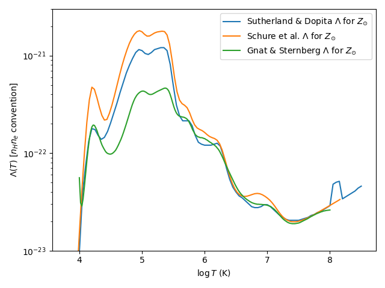

# Summary

Several different conventions exist for the definition of a collisional ionization equilibrium (CIE) cooling curve. They are explained in detail below, with references.

# Conventions

## $n^2 \Lambda$ convention

This convention uses the *total number density* $n$ to define the volumetric cooling rate. The total particle number density is defined as the sum of the number of ions, neutrals, and electrons divided by the volume.

The total number density $n$ is related to the dimensionless mean molecular weight $\mu$ by:

$$n = \frac{\rho}{\mu m_H} \, ,$$ {#eq:number_density}

where $\rho$ is the mass density of the fluid, $m_H$ is the mass of the hydrogen atom, and $\mu$ is the dimensionless mean molecular weight. This may be taken as the definition of $\mu$.

In this convention, the volumetric cooling rate is given by

$$S_{cool} = n^2 \Lambda(T) \, ,$$ {#eq:cooling_rate_nsqLambda}

where $S_{cool}$ is the volumetric cooling source term, $n$ is the total number density and $\Lambda(T)$ is the CIE cooling curve in this convention.

This convention is used by the PLUTO code (see the [PLUTO User Guide](http://plutocode.ph.unito.it/userguide.pdf), section 9.2, equation 9.5).

## $n_i n_e \Lambda$ convention

In this convention, the volumetric cooling rate is given by

$$S_{cool} = n_i n_e \Lambda(T) \, ,$$ {#eq:cooling_rate_nineLambda}

where $S_{cool}$ is the volumetric cooling source term, $n_i$ is the number density of ions (*usually* including neutrals by convention, but this difference should be negligible when CIE is valid), $n_e$ is the number density of electrons, and $\Lambda(T)$ is the CIE cooling curve in this convention.

This convention is adopted by Sutherland and Dopita (1993) in their tabulation of CIE cooling curves (their section 5.2; see also their equations 51-58).

Sutherland and Dopita additionally comment: *"The normalization factor for the cooling function $\Lambda_N$ is taken as $n_t n_e$ where $n_t$ is the total number density of ions and $n_e$ is the total number density of electrons. This definition is generally valid and independent of composition. It differs from the commonly used factor $n_H n_e$ or even $n_e^2$ commonly used in hydrogen-rich plasmas."*

## $n_H n_e \Lambda$ convention

In this convention, the volumetric cooling rate is given by

$$S_{cool} = n_H n_e \Lambda(T) \, ,$$ {#eq:cooling_rate_nHneLambda}

where $S_{cool}$ is the volumetric cooling source term, $n_H$ is the number density of hydrogen *nuclei* (not ions), $n_e$ is the number density of electrons, and $\Lambda(T)$ is the CIE cooling curve in this convention.

This convention is adopted by Schure et al. (2009) in their definition of $\Lambda_N$. However, this is **not** the same $\Lambda_N$ as used by Sutherland and Dopita (1993)!

This convention is adopted by Gnat and Sternberg (2007) in their definition of $\Lambda$.

The following image illustrates a comparison between different cooling curves in this notation:

## $n_H^2 \Lambda$ convention

In this convention, the volumetric cooling rate is given by

$$S_{cool} = n_H^2 \Lambda(T) \, ,$$ {#eq:cooling_rate_nHsqLambda}

where $S_{cool}$ is the volumetric cooling source term, $n_H$ is the number density of hydrogen *nuclei* (not ions), and $\Lambda(T)$ is the CIE cooling curve in this convention.

This convention is adopted by Dalgarno and McCray (1972) (their equation 24), and Schure et al. (2009) in their definition of $\Lambda_{hd}$ (their equation 2).

### AthenaPK implementation

This is the convention adopted by AthenaPK, except $n_H$ is computed assuming zero metals in the mass budget:

$$ x_H = 1 - Y \, , $$

$$ n_H = X_H \rho / m_H  = (1 - Y) \rho / m_H \, .$$

The difference in neglecting metals in the mass budget in computing $n_H$ is only a $\sim 2$ percent effect on $n_H$ (since metals are 2 percent by mass for solar metallicity) and a $\sim 4$ percent effect on the source term.

The Schure table in the GitHub repository uses the $n_H n_e$ convention, rather than the $n_H^2$ convention. This causes an error in the cooling rate of $n_e / n_H$, or about 20 percent for temperatures above $10^{5.5}$ K.

Above $\sim 10^4$ K, there is a percent-level error in the mean molecular weight due to neglecting the metal contribution to the electron fraction. *Users should be aware that at low absolute electron fraction, metals contribute a substantial proportion of the electrons, so this approximation is no longer valid below $\sim 10^4$ K.* The temperature is computed as:

$$ T = \left( \frac{\rho}{\mu m_H} \right)^{-1} \left( \frac{P}{k_B} \right) \, ,$$
where the dimensionless mean molecular weight $\mu$ is computed assuming a zero metallicity gas:

$$ \mu = \left( \frac{3}{4} Y + 2(1 - Y) \right)^{-1} = \left( 2 - \frac{5}{4} Y \right)^{-1} \, ,$$

where $Y$ is the Helium mass fraction.

For a more precise calculation of $\mu$ assuming a scaled-solar composition of metals, we have:

$$ \mu = \left( 1 - x_e \right) \left( X + \frac{Y}{4} + \frac{Z}{\bar A} \right)^{-1} \, , $$

where $\bar A$ is the mass-weighted mean atomic weight of metals:

$$ \bar A = 16 \, .$$

Additionally, for full ionization for all species, we have:

$$ x_e = \frac{X + 2 Y (m_H/m_{He}) + (\bar A/2) Z (m_H/m_{\bar Z})}{2 X + 3 Y (m_H/m_{He}) + (1 + \bar A/2) 
Z (m_H/m_{\bar Z})} \approx \frac{X + Y/2 + Z/2}{2 X + 3 Y/4 + (1/{\bar A} + 1/2) Z}$$

For $Y = 0.24$ and $Z = 0.02$, the mean molecular weight for complete ionization is $\mu \approx 0.60$ (if $Z = 0$, then this yields $\mu \approx 0.59$).

## $n_e^2 \Lambda$ convention

In this convention, the volumetric cooling rate is given by

$$S_{cool} = n_e^2 \Lambda(T) \, ,$$ {#eq:cooling_rate_nHsqLambda}

where $S_{cool}$ is the volumetric cooling source term, $n_e$ is the number density of electrons, and $\Lambda(T)$ is the CIE cooling curve in this convention.

For the case of a hydrogen-only fully-ionized plasma *only*, this is equivalent to the $n_H^2 \Lambda$ convention, since each hydrogen atom contributes exactly one electron and there are no other sources of electrons.

I am not aware of any common tables that use this convention. However, it is noted as one of the possible conventions by Sutherland and Dopita (1993).
