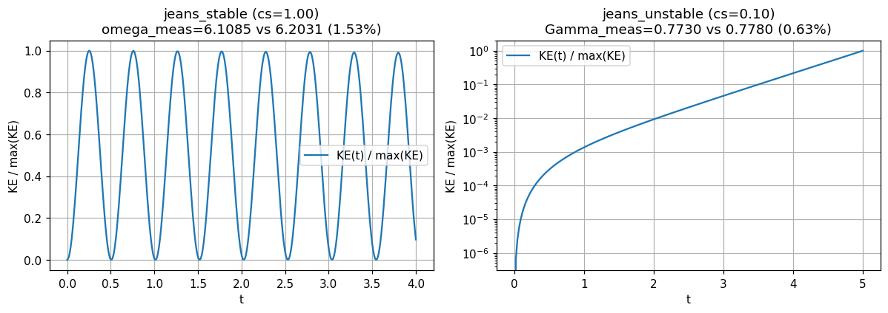
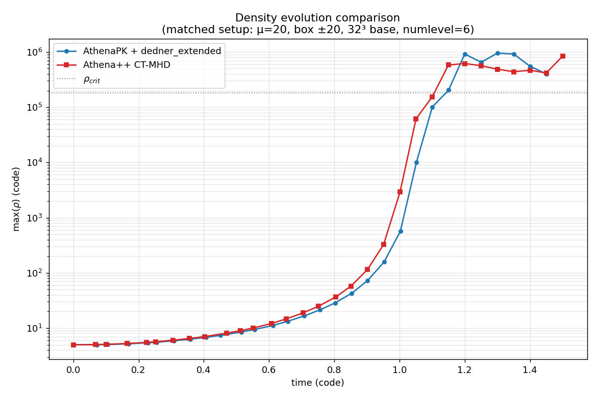

# Self-gravity

AthenaPK can evolve the gas under its own gravity by solving the Poisson equation

$$\nabla^2 \phi = 4\pi G\,\rho$$

on every stage of the integrator and adding the resulting acceleration $-\nabla\phi$ as
an unsplit source term to the momentum and total-energy equations. The solver is a port of the
[Artemis](https://github.com/lanl/artemis) self-gravity module and is built on
Parthenon's geometric-multigrid (GMG) infrastructure.

## Algorithm

- The potential `grav.phi` and the right-hand side `grav.rhs` $= 4\pi G(\rho-\bar\rho)$
  are cell-centered fields registered by the `self_gravity` package. Both are written
  to output (`hdf5` as well as OpenPMD) when listed in a `variables` line. Two internal
  copies of the potential, `grav.phi_prev` (start of stage) and `grav.phi0` (start of
  step), carry it across the hydro update; `grav.phi_prev` is also written to restart
  files.
- The Poisson equation is solved with a **BiCGSTAB Krylov solver preconditioned by
  geometric multigrid** (`parthenon::solvers::BiCGSTABSolver` +
  `MGSolver`), which converges robustly on the block-AMR hierarchy.
- The coupling is **stage-consistent** and follows the VL2 algorithm of Mullen, Hanawa &
  Gammie (2021, their Sect. 3.1). In every integrator stage, after the hydro update and
  with the stage's $\beta\,\Delta t$ weight:
  1. momentum $\mathrel{+}= \beta\Delta t\,\rho^{(\ell-1)} g^{(\ell-1)}$, from the
     start-of-stage density and potential;
  2. the Poisson equation is solved for $\phi^{(\ell)}$ from the updated density;
  3. energy $\mathrel{+}= \beta\Delta t\,F_\rho\cdot\tfrac{1}{2}(g^{(0)}+g^{(\ell)})$, from
     the stage's mass fluxes and the average of the start-of-step and new gravity.

  Both the predictor and the corrector of the VL2 integrator therefore feel gravity. The
  cost is one elliptic solve per stage, plus one at the start of a fresh run and one
  after every change of the mesh (new blocks only hold interpolated potentials).
- **Second-order accuracy.** The momentum source is the one derived by
  [Mullen, Hanawa & Gammie (2021)](https://doi.org/10.3847/1538-4365/abcfbd), their
  Equations (43)-(45) applied per stage as their (63) and (67): the start-of-stage
  density multiplied by the face-averaged gravity of that same density,
  $\rho^{(\ell)}\,\tfrac{1}{2}(g_{i-1/2}+g_{i+1/2})$, weighted by the stage's
  $\beta\,\Delta t$. With one Poisson solve per stage this is second-order accurate in
  space and time, and needs only two solves per step for a two-stage integrator.

  Verified on their test problem (§4.2.1): a Jeans-*stable* linear wave with
  $\lambda/\lambda_J=1/2$ ($c_s=1/\pi$, $\rho_0=1$, $A=10^{-6}$, $\gamma=5/3$,
  $4\pi G=1$, so $\omega^2=3$), evolved a quarter period to $t=\tfrac{\pi}{2\omega}$ and
  compared against the analytic linear solution
  $\rho = \rho_0\,[1 + A\beta\sin kx]$ with
  $\beta = k^2c_s^2(1-\gamma^{-1})/\omega^2 = 8/15$:

  | $N$ | $L_1(\rho)$ | order | modal-amplitude error | order |
  |-----|------------|-------|-----------------------|-------|
  |  32 | 1.807e-09  |   —   | 1.947e-09 |   —   |
  |  64 | 4.354e-10  | 2.05  | 5.242e-10 | 1.89  |
  | 128 | 1.002e-10  | 2.12  | 1.325e-10 | 1.98  |
  | 256 | 2.289e-11  | 2.13  | 3.306e-11 | 2.00  |
  | 512 | 5.421e-12  | 2.08  | 8.233e-12 | 2.01  |

- **Energy conservation.** Step 3 above is exactly the divergence of a gravitational
  energy flux (Mullen et al. 2021, their Eqs. 57, 64 and 68), so the total energy
  $E_{\rm kin}+E_{\rm th}+E_{\rm mag}+\tfrac{1}{2}\int(\rho-\bar\rho)\phi\,dV$ is conserved to
  round-off whenever the Poisson solve is. Measured on their Sect. 4.2.2 problem (the
  unstable Jeans mode of the regression test, $A=10^{-3}$, run to $t=8$ where the density
  contrast is 1.5, gravitational energy from an exact FFT solve of the same discrete
  operator): the change of total energy relative to the gravitational energy released is
  $\le 1.3\times10^{-9}$ at all times and $1.1\times10^{-14}$ at $t=8$ (absolute changes
  $\le 7\times10^{-21}$ on a total of $9.4\times10^{-6}$), against a steady
  $2$-$2.5\times10^{-4}$ for the previous, instantaneous-gravity energy source.

  Two conditions apply. The energy is exact only if the last integrator stage restarts
  from the start-of-step state, which holds for `vl2` (the default) and `rk1`; with `rk2`
  and `rk3` the scheme stays second-order accurate but is not exactly conservative. And
  the Poisson solve has to reach its tolerance: set `absolute_residual_tolerance` above
  the round-off floor of the residual (about $10^{-13}$ relative to the right-hand side
  in double precision). A BiCGSTAB solve asked for less keeps iterating on round-off and
  can return a corrupted potential when it hits `max_iterations`.
- The source term writes interior cells only and runs after the stage's boundary
  exchange (the solve is global, so it cannot sit inside the stage task list), so the
  ghost zones are re-communicated before `FillDerived`. Without that, the next stage's
  reconstruction would use ghost values missing one gravitational kick.
- For fully periodic domains the **Jeans swindle** (`use_swindle`) subtracts the mean
  density so the periodic Poisson problem is well posed.

## Enabling self-gravity

Self-gravity is enabled from its own block by selecting a Poisson solver. The mesh must
have multigrid enabled.

```
<parthenon/mesh>
multigrid = true          # required by the GMG-preconditioned solver

<self_gravity>
solver         = multigrid  # "none" (default) disables self-gravity
four_pi_G      = 1.0        # value of 4*pi*G in code units
use_swindle    = true       # subtract mean density (default: true iff fully periodic)

# Gravity boundary conditions, per face (ix1_bc/ox1_bc/.../ix3_bc/ox3_bc).
# "default" inherits the hydro BC; "zero" imposes homogeneous Dirichlet (phi=0).
ix1_bc = zero
ox1_bc = zero
# ... etc

<self_gravity/multigrid_solver_params>
preconditioner               = Multigrid
max_iterations               = 200
residual_tolerance           = 1.0e-10
absolute_residual_tolerance  = 1.0e-10
relative_residual            = true
relative_residual_tolerance  = 1.0e-6
```

### The gravitational constant

The solver works entirely in code units: `self_gravity/four_pi_G` is the value of
$4\pi G$ in those units. The default `1.0` is the usual normalization of the Jeans and
Bonnor-Ebert setups; a problem posed in physical units simply passes the corresponding
code-unit value.

### Input parameters

| Block | Parameter | Default | Meaning |
|-------|-----------|---------|---------|
| `<self_gravity>` | `solver` | `none` | Poisson solver. `multigrid` enables self-gravity via the GMG infrastructure; `none` disables the package. |
| `<parthenon/mesh>` | `multigrid` | `false` | Must be `true`; enables the GMG hierarchy. |
| `<self_gravity>` | `four_pi_G` | `1.0` | Value of $4\pi G$ in code units. |
| `<self_gravity>` | `use_swindle` | periodic? | Subtract the mean density from the RHS. Defaults to `true` for a fully periodic domain, `false` otherwise. |
| `<self_gravity>` | `{i,o}x{1,2,3}_bc` | `default` | Per-face gravity BC. `default` follows the hydro BC; `zero` = homogeneous Dirichlet. |
| `<self_gravity>` | `packed_bc` | `true` | Apply the `zero`/`neumann` $\phi$ BCs to a whole `MeshData` in one kernel per face during the solve (large GPU launch-latency saving at deep AMR; bit-identical to the per-block path). Automatically falls back to the per-block path for any other face type. |
| `<self_gravity/multigrid_solver_params>` | `solver_type` | `BiCGSTAB` | `BiCGSTAB` = GMG-preconditioned Krylov solver (robust default). `MG` = pure geometric multigrid, which avoids the two global reductions per Krylov iteration (helps latency-bound multi-rank GPU runs) but requires at least the SRJ2 smoother (the Parthenon `MGParams` default) on AMR grids. |
| `<self_gravity/multigrid_solver_params>` | `preconditioner` | `Multigrid` | Krylov preconditioner. |
| `<self_gravity/multigrid_solver_params>` | `max_iterations` | — | Maximum Krylov iterations per solve. |
| `<self_gravity/multigrid_solver_params>` | `residual_tolerance`, `relative_residual_tolerance`, `absolute_residual_tolerance` | — | Convergence tolerances, see the [Parthenon solver documentation](https://parthenon-hpc-lab.github.io/parthenon/develop/src/solvers.html). |

> **Boundary-condition caveat.** Each face may be `zero` (homogeneous Dirichlet,
> $\phi=0$), `neumann` (homogeneous Neumann, $\partial\phi/\partial n=0$, e.g. a
> symmetry plane), or `default` (inherit the hydro BC; periodic faces give a periodic
> $\phi$). An **all**-Neumann domain is gauge-unfixed (the potential is then determined
> only up to an additive constant) and isolated-mass (multipole) BCs are **not**
> implemented — use `zero` Dirichlet faces for isolated collapse problems (as in
> `inputs/collapse_be.in`).

## Jeans-length refinement

The port adds a refinement criterion that keeps the local Jeans length resolved by at
least `njeans` cells (Truelove et al. 1997), which is essential for suppressing
artificial fragmentation during collapse:

```
<parthenon/mesh>
refinement = adaptive

<refinement>
type   = jeans
njeans = 8            # refine when lambda_J / dx < njeans (typically 8-16)
```

A block is flagged for refinement when $\lambda_J/\Delta x < N_{\rm Jeans}$ and for
derefinement when $\lambda_J/\Delta x > 2.5\,N_{\rm Jeans}$, with
$\lambda_J = 2\pi c_s/\sqrt{\rho}$ (hydro) or $2\pi(c_s+v_A)/\sqrt{\rho}$ (MHD) in
$4\pi G=1$ units.

## Example problems

Two problem generators exercise the solver and ship with matching input decks:

- **`jeans`** (`src/pgen/jeans.cpp`, `inputs/jeans.in`) — a uniform periodic box with a
  small sinusoidal density perturbation, used to validate the linear Jeans dispersion
  relation. The deck runs the Jeans-unstable regime; comment/uncomment `cs` for the
  stable one.
- **`collapse_be`** (`src/pgen/collapse_be.cpp`, `inputs/collapse_be.in`) — collapse of
  a marginally-stable Bonnor-Ebert sphere, driven to first-hydrostatic-core densities.
  The setup is posed entirely in code units, in the normalization of Tomida (2011):
  $4\pi G=1$, isothermal sound speed $c_s=1$, and central density of the *critical*
  Bonnor-Ebert sphere $=1$, which fixes its radius at $6.45$ and its mass at $197.561$.
  The only free parameters are then the central density `f`, the barotropic stiffening
  density `rhocrit`, the amplitude `amp` of an $m=2$ perturbation and the rotation rate
  `omegatff` in units of $1/t_{\rm ff}$; the shipped deck corresponds to a 6 M$_\odot$
  cloud at 10 K with $\rho_{\rm crit}=10^{-13}\,$g cm$^{-3}$.

  Note that despite `<hydro> eos = adiabatic`, this setup is **not** an ideal-gas run:
  its problem-specific unsplit source term overwrites the thermal energy every stage
  with a barotropic equation of state, $e_{\rm th} = \rho/(\gamma-1)\sqrt{1 +
  (\rho/\rho_{\rm crit})^{2(\gamma-1)}}$, which is exactly isothermal below
  $\rho_{\rm crit}$ and stiffens to an adiabat of index $\gamma$ above it. `gamma`
  therefore only sets the stiff branch. The same source also zeroes the momentum of every
  cell outside the sphere radius once per stage. This holds the ambient medium at rest but
  does not seal the sphere: the face fluxes are computed before the source is applied,
  from reconstructed states on both sides of $r = r_c$, so mass and energy still cross
  it.

## Validation

### Jeans dispersion relation

The `jeans` regression test (`tst/regression/test_suites/jeans`) seeds a small
sinusoidal perturbation with zero initial velocity and checks the evolution of the
total kinetic energy against linear theory,

$$\omega^2 = k^2 c_s^2 - 4\pi G\rho_0,$$

for both the stable ($\omega^2>0$, oscillating) and unstable ($\omega^2<0$, growing)
regimes. The measured oscillation frequency and growth rate agree with the analytic
dispersion relation to within a few percent.



### Bonnor-Ebert collapse and cross-code comparison

The `collapse_be` setup collapses to first-core densities and, in a matched-physics
comparison, tracks the reference CT-MHD code Athena++ on the same problem. The peak
density runs away by $>5$ orders of magnitude and crosses $\rho_{\rm crit}$ at nearly
the same time in both codes, while the Jeans-length AMR criterion progressively adds
refinement levels as the core forms.


