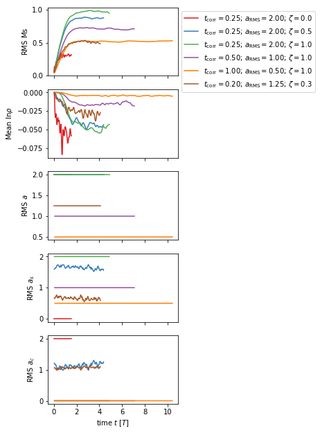
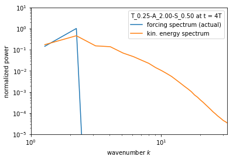
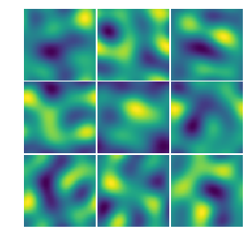

# Driven turbulence simulations

The turbulence problem generator uses explicit inverse Fourier transformations (iFTs)
on each meshblock in order to reduce communication during the iFT.
Thus, it is only efficient if comparatively few modes are used (say < 100).

Quite generally, driven turbulence simulations start from uniform initial conditions
(uniform density and pressure, some initial magnetic field configuration in case of an
MHD setup, and the fluid at rest) and reach a state of stationary, isotropic (or anisotropic
depending on the strength of the background magnetic field) turbulence after one to few
large eddy turnover times (again depending on the background magnetic field strength).
The large eddy turnover time is usually defined as `T = L/U` with `L` being the scale
of the largest eddies and `U` the root mean square Mach number in the stationary regime.

The current implementation uses the following forcing spectrum
`(k/k_peak)^2 * (2 - (k/k_peak)^2)`.
Here, `k_peak` is the peak wavenumber of the forcing spectrum. It is related the scales of the largest eddies as
`L = 1/k_f` given that a box size of 1 is currently assumed/hardcoded.

## Problem setup

An example parameter file can be found in `inputs/turbulence.in`.

A typical setup contains the following blocks in the input file:

```
<job>
problem_id = turbulence

<problem/turbulence>
rho0         = 1.0      # initial mean density
p0           = 1.0      # initial mean pressure
b0           = 0.01     # initial magnetic field strength
b_config     = 0        # 0 - net flux; 1 - no net flux uniform B; 2 - non net flux sin B; 4 - field loop
kpeak        = 2.0      # characteristic wavenumber
corr_time    = 1.0      # autocorrelation time of the OU forcing process
rseed        = 20190729 # random seed of the OU forcing process
sol_weight   = 1.0      # solenoidal weight of the acceleration field
accel_rms    = 0.5      # root mean square value of the acceleration field
num_modes    = 30       # number of wavemodes

<modes>
k_1_0	= +2
k_1_1	= -1
k_1_2	= +0
k_2_0	= +1
...
```

Following parameters can be changed to control both the initial state 

- `rho0` initial mean density
- `p0` initial mean thermal pressure
- `b0` initial mean magnetic field strength
- `b_config`
  - `0`: net flux case (uniform B_x)
  - `1`: no net flux case (uniform B_x with changing sign in each half of the box)
  - `2`: no net flux with initial sinosoidal B_x field
  - `3`: deprecated
  - `4`: closed field loop/cylinder in the box (in x-y plane) located at
    - `x0=0.5` (default)
    - `y0=0.5` (default)
    - `z0=0.5` (default)
    - and radius `loop_rad=0.25`

as well as the driving field

- `kpeak` peak wavenumber of the forcing spectrum. Make sure to update the wavemodes to match `kpeak`, see below.
- `corr_time` autocorrelation time of the acceleration field (in code units).
Using delta-in-time forcing, i.e., a very low value, is discouraged, see [Grete et al. 2018 ApJL](https://iopscience.iop.org/article/10.3847/2041-8213/aac0f5).
- `rseed` random seed for the OU process. Only change for new simulation, but keep unchanged for restarting simulations.
- `sol_weight` solenoidal weight of the acceleration field. `1.0` is purely solenoidal/rotational and `0.0` is purely dilatational/compressive. Any value between `0.0` and `1.0` is possible. The parameter is related to the resulting rotational power in the 3D acceleration field as
`1. - ((1-sol_weight)^2/(1-2*sol_weight+3*sol_weight^2))`, see eq (9) in [Federrath et al. 2010 A&A](
https://doi.org/10.1051/0004-6361/200912437).
- `accel_rms` root mean square value of the acceleration (controls the "strength" of the forcing field)
- `num_modes` number of wavemodes that are specified in the `<modes>` section of the parameter file.
In order to generate a full set of modes run the `inputs/generate_fmturb_modes.py` script and replace
the corresponding parts of the parameter file with the output of the script.
Within the script, the top three variables (`k_peak`, `k_high`, and `k_low`) need to be adjusted in
order to generate a complete set (i.e., all) of wavemodes.
Alternatively, wavemodes can be chosen/defined manually, e.g., if not all wavemodes are desired or
only individual modes should be forced.

## Typical results

The results shown here are obtained from running simulations with the parameters given in the next section.

### High level temporal evolution


### Power spectra


### Consistency of acceleration field
As each meshblock does a full iFT of all modes the following slices from a run with 8 meshblocks 
illustrate that there is no discontinuities at the meshblock boundary.

Plot shows x-, y-, and z-acceleration (in rows top to bottom) slices in the x-, y-, and z-direction (in columns from left to right).

